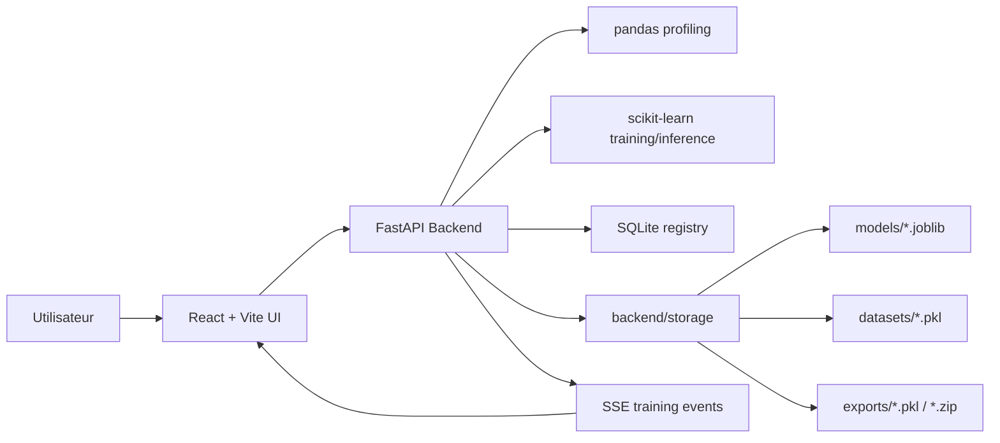

# Nexus AutoML

Nexus AutoML est une application locale d'Automated Machine Learning qui combine une interface React avec un backend Python FastAPI. Elle permet d'importer un dataset, d'en contrôler la qualité, de définir une cible de prédiction, d'entraîner plusieurs modèles scikit-learn, de comparer leurs performances, puis d'exporter ou d'utiliser le modèle validé en inférence.

L'objectif du projet est de rendre le cycle ML plus fluide pour un usage local : exploration, entraînement, validation, registry, export et inférence sont regroupés dans une seule interface.

## Fonctionnalités

- Import de datasets CSV, XLS et XLSX.
- Génération d'un dataset de démonstration avec scikit-learn.
- Profiling automatique avec pandas : types de colonnes, valeurs manquantes, cardinalité, exemples de valeurs.
- Rapport de qualité : missing rate, doublons, colonnes constantes, cardinalité élevée, warnings.
- Choix guidé de la colonne cible, du type de problème et des features à exclure.
- Entraînement asynchrone avec progression temps réel via Server-Sent Events.
- Modèles entraînés avec scikit-learn :
  - Random Forest
  - Gradient Boosting
  - Logistic Regression pour classification
  - Ridge Regression pour régression
- Validation holdout et cross-validation.
- Métriques enrichies :
  - classification : accuracy, f1, precision, recall, rapport par classe, matrice de confusion, ROC si disponible
  - régression : RMSE, R2, MAE, MAPE
- Feature importance lorsque le modèle le permet.
- Registry persistant avec SQLite.
- Inférence unitaire depuis l'interface.
- Inférence batch sur CSV ou Excel.
- Export unitaire en `.pkl`.
- Export bundle `.zip` avec modèle, metadata, requirements et exemple d'inférence.

## Stack Technique

### Frontend

- React 19
- TypeScript
- Vite
- Tailwind CSS
- Recharts
- lucide-react
- motion

### Backend

- Python 3.10+
- FastAPI
- Uvicorn
- pandas
- numpy
- scikit-learn
- joblib
- SQLite

## Installation

### Prérequis

- Node.js
- Python 3.10+
- pip

### Installation simplifiée sous Windows

Sur Windows, le projet fournit deux lanceurs double-clic à la racine :

| Fichier | Rôle |
| --- | --- |
| `Install-Windows.cmd` | Crée `.venv`, installe les dépendances Python, installe les dépendances npm et crée `.env.local` |
| `NexusAutoML-Windows.cmd` | Lance le backend Python et le frontend dans deux fenêtres PowerShell |

Étapes recommandées :

1. Installer Python 3.10+ depuis python.org en cochant `Add python.exe to PATH`.
2. Installer Node.js LTS depuis nodejs.org.
3. Double-cliquer sur `Install-Windows.cmd`.
4. Double-cliquer sur `NexusAutoML-Windows.cmd`.
5. Ouvrir l'URL affichée dans la fenêtre Vite, généralement `http://localhost:3000`.

Le backend Windows utilise exclusivement Python via :

```powershell
.\.venv\Scripts\python.exe -m backend
```

Les scripts Windows sont dans :

```text
scripts/windows/
```

Ils peuvent aussi être lancés manuellement :

```powershell
powershell.exe -ExecutionPolicy Bypass -File .\scripts\windows\setup.ps1
powershell.exe -ExecutionPolicy Bypass -File .\scripts\windows\start-app.ps1
```

### Installation des dépendances frontend

```bash
npm install
```

### Installation des dépendances backend

```bash
python3 -m pip install -r requirements.txt
```

### Configuration

Copier le fichier d'exemple :

```bash
cp .env.example .env.local
```

Variable principale :

```bash
VITE_API_BASE_URL="http://localhost:8000"
```

## Lancement Local

### Windows

Après l'installation :

```cmd
NexusAutoML-Windows.cmd
```

Ou en deux terminaux PowerShell :

```powershell
.\.venv\Scripts\python.exe -m backend
```

```powershell
npm run dev
```

### Option recommandée : deux terminaux

Terminal 1, backend :

```bash
python3 -m backend
```

Le backend démarre sur :

```text
http://localhost:8000
```

Terminal 2, frontend :

```bash
npm run dev
```

Le frontend démarre en général sur :

```text
http://localhost:3000
```

Si le port 3000 est occupé, Vite choisira automatiquement un autre port, par exemple `3001`.

### Backend avec reload

Le backend reste exclusivement Python. Pour activer le reload FastAPI en développement :

```bash
BACKEND_RELOAD=true python3 -m backend
```

Variables disponibles :

| Variable | Défaut | Description |
| --- | --- | --- |
| `BACKEND_HOST` | `127.0.0.1` | Interface réseau du backend |
| `BACKEND_PORT` | `8000` | Port du backend |
| `BACKEND_RELOAD` | `false` | Active le reload uvicorn |

## Scripts NPM

Les scripts npm sont réservés au frontend. Le backend se lance avec Python.

| Commande | Description |
| --- | --- |
| `npm run dev` | Lance le frontend Vite |
| `npm run build` | Compile le frontend de production |
| `npm run preview` | Prévisualise le build Vite |
| `npm run lint` | Vérifie TypeScript avec `tsc --noEmit` |
| `npm run clean` | Supprime `dist/` |

## Notes Windows

- Utiliser PowerShell ou Windows Terminal plutôt que l'ancien `cmd.exe` pour les commandes manuelles.
- Si PowerShell bloque les scripts, les fichiers `.cmd` fournis lancent PowerShell avec `ExecutionPolicy Bypass` uniquement pour la session.
- Si Python n'est pas détecté, réinstaller Python et cocher `Add python.exe to PATH`.
- Si le frontend ne s'ouvre pas sur `3000`, vérifier l'URL exacte affichée par Vite.
- La base SQLite, les datasets et les modèles restent dans `backend/storage/`.

## Guide Utilisateur

### 1. Ouvrir l'application

Lancer le backend et le frontend, puis ouvrir l'URL du frontend dans le navigateur.

L'écran `Data & Config` affiche le statut du backend Python. Si le backend est disponible, le statut indique `Backend Online`.

### 2. Charger un dataset

Deux options sont disponibles :

- `File Upload` : importer un fichier CSV, XLS ou XLSX.
- `Python Demo` : générer un dataset de démonstration avec le backend Python.

Après l'import, l'application affiche :

- le nombre de lignes et colonnes ;
- les types détectés ;
- les valeurs manquantes ;
- le nombre de valeurs uniques ;
- des exemples de valeurs ;
- un rapport de qualité.

### 3. Vérifier la qualité des données

Le bloc `Data Quality` résume les principaux problèmes :

- cellules manquantes ;
- taux de valeurs manquantes ;
- lignes dupliquées ;
- colonnes constantes ;
- colonnes à forte cardinalité ;
- warnings prioritaires.

Ces informations servent à repérer rapidement les colonnes qui risquent de dégrader l'entraînement.

### 4. Définir l'objectif ML

Dans `Modeling Objective` :

1. Choisir la colonne cible.
2. Choisir le type de problème :
   - `Classification`
   - `Regression`
3. Exclure éventuellement certaines features.

Les colonnes exclues ne seront pas utilisées à l'entraînement.

### 5. Entraîner les modèles

Cliquer sur `Train with Python`.

Le pipeline démarre un job d'entraînement asynchrone côté FastAPI. L'interface affiche :

- progression du job ;
- logs temps réel ;
- étapes du pipeline ;
- statut succès/erreur.

À la fin, l'application redirige vers le leaderboard.

### 6. Comparer les modèles

L'écran `Evaluation` permet de comparer les modèles entraînés.

On y trouve :

- score principal ;
- temps d'entraînement ;
- métriques secondaires ;
- cross-validation ;
- feature importance ;
- courbes et graphiques selon le type de modèle.

Le meilleur modèle est affiché en tête, mais l'utilisateur peut sélectionner un autre modèle.

### 7. Consulter le Model Registry

L'écran `Model Registry` conserve :

- les datasets importés ;
- les modèles entraînés ;
- l'identifiant des modèles ;
- la date d'entraînement ;
- les métriques ;
- le modèle actif ;
- les exports disponibles.

Le registre est persistant grâce à SQLite.

### 8. Exporter un modèle

Chaque modèle validé peut être exporté individuellement.

Formats disponibles :

- `.pkl` : export pickle direct du pipeline scikit-learn ;
- `.zip` : bundle complet contenant :
  - `model.pkl`
  - `metadata.json`
  - `requirements.txt`
  - `inference_example.py`

Le bundle est recommandé pour partager ou redéployer un modèle proprement.

### 9. Faire une prédiction unitaire

Dans `Inference` :

1. Remplir les features.
2. Cliquer sur `Run Prediction`.
3. Lire la prédiction, la confiance si disponible et la latence.

Le backend utilise le pipeline Python sérialisé pour produire la prédiction.

### 10. Faire une inférence batch

Dans `Inference`, utiliser `Batch Score CSV`.

Le fichier doit contenir les colonnes attendues par le modèle. Le backend renvoie un CSV enrichi avec :

- `prediction`
- `confidence` si disponible
- `model_id`

## Architecture



### Frontend

Le frontend est responsable de :

- l'expérience utilisateur ;
- la navigation ;
- l'affichage des datasets ;
- la sélection de la cible ;
- le suivi live du training ;
- les dashboards ;
- les exports côté navigateur ;
- l'inférence unitaire et batch.

Fichiers principaux :

| Fichier | Rôle |
| --- | --- |
| `src/App.tsx` | Routage applicatif par vue |
| `src/types.ts` | Types partagés côté frontend |
| `src/store.ts` | Reducer global de l'application |
| `src/lib/api.ts` | Client HTTP vers FastAPI |
| `src/views/SetupView.tsx` | Import dataset, qualité data, objectif ML |
| `src/views/PipelineView.tsx` | Suivi du job d'entraînement |
| `src/views/DashboardView.tsx` | Leaderboard et métriques |
| `src/views/PredictView.tsx` | Inférence unitaire et batch |
| `src/views/VersionsView.tsx` | Registry et exports |

### Backend

Le backend est responsable de :

- parsing CSV/Excel ;
- profiling pandas ;
- génération du dataset de démo ;
- persistance du registry ;
- orchestration des jobs ;
- entraînement scikit-learn ;
- calcul des métriques ;
- inférence ;
- exports.

Fichier principal :

```text
backend/main.py
```

Stockage local :

```text
backend/storage/
  registry.sqlite3
  datasets/
  models/
  exports/
```

`backend/storage/` est ignoré par Git, car il contient des artefacts locaux.

## Pipeline ML

### Ingestion

Le backend lit les fichiers :

- CSV avec `pandas.read_csv`
- Excel avec `pandas.read_excel`

Le dataset est nettoyé de manière minimale :

- noms de colonnes normalisés ;
- chaînes vides converties en valeurs manquantes ;
- colonnes totalement vides supprimées.

### Profiling

Pour chaque colonne :

- type détecté ;
- nombre de valeurs manquantes ;
- nombre de valeurs uniques ;
- exemples de valeurs.

Types possibles :

- `numeric`
- `categorical`
- `datetime`
- `text`

### Préparation

Le pipeline scikit-learn applique :

- imputation médiane sur les colonnes numériques ;
- standardisation numérique ;
- imputation par valeur fréquente sur les colonnes catégorielles ;
- one-hot encoding des catégories.

### Entraînement

Selon le type de problème :

Classification :

- Random Forest Classifier
- HistGradientBoostingClassifier
- Logistic Regression

Régression :

- Random Forest Regressor
- HistGradientBoostingRegressor
- Ridge Regression

### Validation

Le backend calcule :

- split holdout 80/20 ;
- cross-validation ;
- métriques adaptées au problème.

### Registry

Chaque modèle entraîné est enregistré avec :

- ID ;
- dataset source ;
- métriques ;
- hyperparamètres ;
- feature importance ;
- colonnes utilisées ;
- colonnes exclues ;
- chemin local du modèle sérialisé.

## API Backend

### Santé

```http
GET /health
```

Retourne le statut du backend, le moteur utilisé et les compteurs datasets/modèles/jobs.

### Registry

```http
GET /api/registry
```

Retourne les datasets, modèles et jobs persistés.

### Upload Dataset

```http
POST /api/datasets/upload
```

Form-data :

```text
file=<dataset.csv|dataset.xlsx>
```

### Dataset Démo

```http
POST /api/datasets/demo
```

Crée un dataset de classification synthétique.

### Entraînement Synchrone

```http
POST /api/models/train
```

Payload :

```json
{
  "dataset_id": "ds_xxx",
  "target_column": "is_active",
  "problem_type": "classification",
  "excluded_columns": [],
  "validation_folds": 3
}
```

### Entraînement Asynchrone

```http
POST /api/models/train/jobs
```

Démarre un job en arrière-plan.

### Lire un Job

```http
GET /api/jobs/{job_id}
```

### Stream d'un Job

```http
GET /api/jobs/{job_id}/events
```

Flux SSE utilisé par le frontend pour afficher les logs et la progression.

### Détail Modèle

```http
GET /api/models/{model_id}
```

Retourne la model card complète.

### Prédiction Unitaire

```http
POST /api/models/predict
```

Payload :

```json
{
  "model_id": "model_xxx",
  "features": {
    "feature_a": 12.4,
    "feature_b": "segment_a"
  }
}
```

### Prédiction Batch

```http
POST /api/models/{model_id}/batch-predict
```

Form-data :

```text
file=<batch.csv|batch.xlsx>
```

Retourne un CSV scoré.

### Export Pickle

```http
GET /api/models/{model_id}/export
```

Télécharge un modèle validé en `.pkl`.

### Export Bundle

```http
GET /api/models/{model_id}/export-bundle
```

Télécharge un bundle `.zip`.

## Structure du Projet

```text
Nexus-ML/
  backend/
    __init__.py
    main.py
    storage/
      registry.sqlite3
      datasets/
      models/
      exports/
  src/
    components/
      layout/
    lib/
      api.ts
      utils.ts
    views/
      AgentView.tsx
      DashboardView.tsx
      ExploreView.tsx
      PipelineView.tsx
      PredictView.tsx
      SetupView.tsx
      VersionsView.tsx
    App.tsx
    index.css
    main.tsx
    store.ts
    types.ts
  .env.example
  package.json
  requirements.txt
  vite.config.ts
```

## Données et Persistance

Les artefacts locaux sont stockés dans :

```text
backend/storage/
```

Contenu :

- `registry.sqlite3` : registry persistant ;
- `datasets/*.pkl` : datasets profilés ;
- `models/*.joblib` : pipelines scikit-learn ;
- `exports/*.pkl` : exports pickle ;
- `exports/*.zip` : bundles d'export.

Ces fichiers ne doivent pas être commités.

## Export et Réutilisation d'un Modèle

### Export `.pkl`

Le fichier `.pkl` contient le pipeline scikit-learn complet :

- preprocessing ;
- imputation ;
- encoding ;
- modèle final.

Exemple de chargement :

```python
import pickle
import pandas as pd

with open("model.pkl", "rb") as file:
    model = pickle.load(file)

frame = pd.DataFrame([
    {
        "feature_a": 1.0,
        "feature_b": "A"
    }
])

prediction = model.predict(frame)
print(prediction)
```

### Export Bundle

Le bundle `.zip` est recommandé pour transmettre un modèle, car il contient aussi les métadonnées et un exemple d'inférence.

## Validation et Tests

Vérification TypeScript :

```bash
npm run lint
```

Build frontend :

```bash
npm run build
```

Compilation Python :

```bash
python3 -m compileall backend
```

Test santé backend :

```bash
curl http://localhost:8000/health
```

## Limites Connues

- Le registry est local à la machine.
- SQLite convient au local, mais un déploiement multi-utilisateur devrait migrer vers PostgreSQL.
- Les jobs d'entraînement tournent dans le process FastAPI ; pour de gros datasets, un worker dédié serait préférable.
- La feature importance dépend du modèle utilisé.
- SHAP n'est pas encore intégré.
- Le frontend peut générer un warning Vite sur la taille du bundle, principalement à cause des bibliothèques de visualisation.

## Roadmap Possible

- Authentification et espaces projets.
- Worker Celery/RQ pour jobs longs.
- Support SHAP complet.
- Tracking d'expériences plus avancé.
- Gestion de versions de datasets plus stricte.
- Déploiement modèle sous forme d'endpoint dédié.
- Monitoring de drift et qualité en production.

## Licence

Projet privé/local. Ajouter une licence si le projet doit être partagé ou publié.
